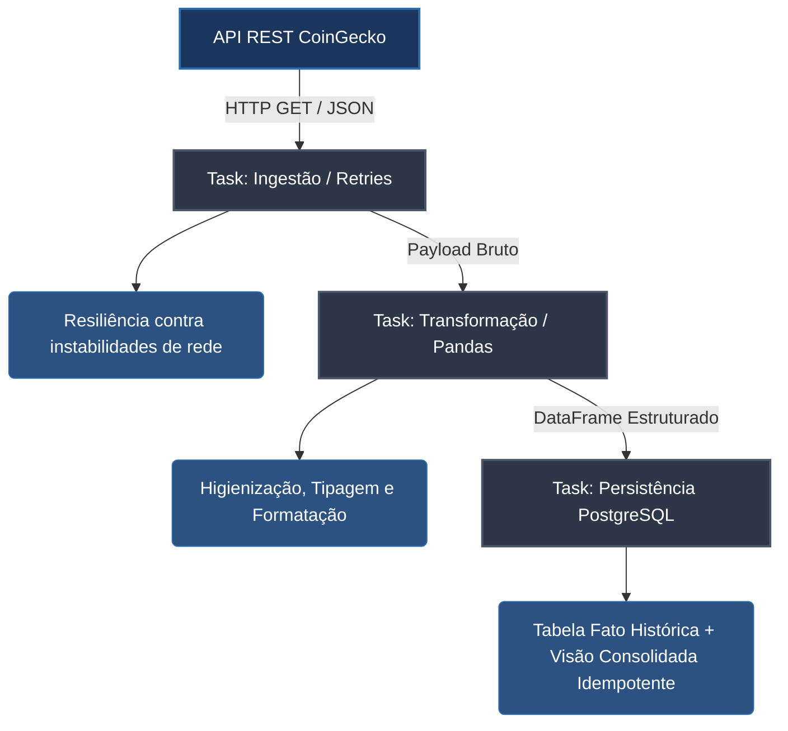

# Pipeline Financeiro de Cotações de Criptomoedas

## 1. Contexto e Descrição do Problema
No ecossistema de ativos financeiros digitais, a alta volatilidade e o fluxo ininterrupto de dados exigem estruturas de ingestão capazes de capturar, tratar e persistir indicadores de mercado com baixa latência e alta confiabilidade. Aplicações analíticas e algoritmos de negociação dependem de visões históricas consistentes e consolidações em tempo real para tomada de decisão estratégica.

Este projeto abrange a construção de um pipeline de dados (*data pipeline*) automatizado, resiliente a falhas de comunicação com APIs públicas e imune a inconsistências causadas por reexecuções (garantia de idempotência). A solução abstrai a complexidade da captura de cotações, executa higienização e padronização de schemas e disponibiliza os dados em um repositório relacional estruturado para consumo analítico.

---

## 2. Arquitetura da Solução
A arquitetura da solução adota o padrão de pipeline containerizado e descentralizado, orquestrado pelo **Prefect 3.0** e persistida em banco de dados **PostgreSQL 15**:



### Componentes do Pipeline:
1. **Fonte de Dados (Ingestão):** Consumo de payloads JSON da API REST pública da CoinGecko `(/simple/price)`, capturando preços em USD, volume de negociação de 24 horas e variações percentuais dos ativos (``bitcoin``, ``ethereum``, ``solana``, ``cardano``).
2. **Camada de Orquestração:** Utilização do Prefect 3.0 para gerenciamento de dependências, controle de estado do fluxo de trabalho, registro de logs em tempo real e reexecução automatizada em caso de exceções.
3. **Camada de Processamento:** Manipulação vetorial via biblioteca ``pandas`` para conversão de tipos de dados (casting), rotulagem temporal (timestamping) e estruturação em dados tabulares.
4. **Camada de Armazenamento:** Banco de dados relacional PostgreSQL persistindo duas estruturas relacionais:

- ``fact_crypto_prices:`` Tabela transacional histórica (append-only) contendo todas as capturas realizadas.

- ``latest_crypto_prices:`` Tabela analítica consolidada (_state view_) mantida de forma idempotente (``replace``), representando a foto mais recente do mercado.

## 3. Justificativa das Escolhas de Arquitetura e Tecnologia
- **Prefect 3.0 (vs. Apache Airflow):** A opção pelo Prefect fundamenta-se na sua arquitetura moderna Python-native, reduzindo a complexidade infraestrutural em comparação ao ecossistema do Airflow (que exigiria múltiplos containers dedicados como Scheduler, Webserver e Celery Workers). O Prefect oferece decoradores nativos (``@flow`` e ``@task``), baixa pegada de memória RAM e rastreamento reativo de erros na UI.
- **PostgreSQL 15:** Escolhido por sua robustez transacional ACID, suporte avançado a indexação e ampla compatibilidade com ferramentas de visualização de dados (_BI Tools_).
- **Docker e Docker Compose:** A containerização integral garante o cumprimento do princípio de _Infraestrutura como Código_ (IaC), permitindo a reprodutibilidade completa do ambiente produtivo de forma agnóstica ao sistema operacional hospedeiro.

## 4. Instruções de Execução
### Pré-requisitos:
- Docker Desktop e Docker Compose instalados e em execução.
### Passo a Passo para Subir o Ambiente:
1. Clone este repositório ou navegue até o diretório raiz do projeto:
```bash
cd trabalho-final-orquestracao-de-workflows
```
2. Inicialize a infraestrutura containerizada via Docker Compose:
```bash 
docker compose up --build
```
3. Acompanhe a subida dos serviços no terminal. Após a inicialização do container pipeline_runner, acesse a interface visual do orquestrador:

- Prefect Dashboard UI: http://localhost:4200

- Banco de Dados PostgreSQL: localhost:5432 (Credenciais: ``admin`` / ``adminpassword`` | Database: ``finance_db``)
Acesse a interface em http://localhost:4200.

## 5. Idempotência e Resiliência
- **Resiliência:** A tarefa de extração (``extract_crypto_data``) incorpora políticas de tolerância a falhas através de retries automáticos (``retries=3``, ``retry_delay_seconds=5``) com tempo de espera entre tentativas. Caso a API pública sofra oscilações temporárias de rede ou limites de requisição (_rate limiting_), o orquestrador gerencia a reconexão sem interromper o fluxo global.

- **Idempotência:** A consistência do repositório final é assegurada pelo modelo de gravação híbrido. A gravação da tabela analítica de estado (``latest_crypto_prices``) utiliza a estratégia de sobrescrita atômica (``if_exists="replace"``), garantindo que múltiplas execuções do pipeline no mesmo intervalo temporal gerem exatamente o mesmo resultado final, sem duplicação de dados.

## Vídeo de Apresentação
- **Link do Vídeo:** [INSERIR_LINK_AQUI]